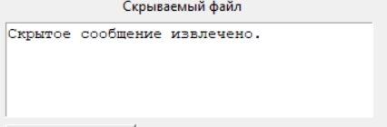

# Implementation of LSB-R, LSB-M and Hamming code methods for embedding files in digital images
**This code is an implementation of steganographic methods. The input data is a hidden file, empty digit containerм and pixel embedding rate for LSB-R/M.**

<div align="center">
  
  
  

  [LSB-R and LSB-M](#lsb-r-and-lsb-m) •  
  [Hamming code](#hamming-code) • 
  
</div>

#

The pixel embedding rate is the number of least significant bits involved in each RGB channel. Accordingly, the higher the rate of implementation, the more information can be hidden and the more distortions there will be in the digital object.

For this software implementation to work, 4 libraries are needed: *tkinter*, *PIL*, *numpy* and *random*.

*tkinter* is a built-in library from the python 3 version, if you do not have it for some reason, then you can install it using the following command:

```sh
pip3 install tkinter
```

*PIL* is a library for working with images, you can install it using the following command:

```sh
pip3 install pillow
```

*numpy* is a library for working with various mathematical functions, multidimensional arrays and much more, you can install it using the following command:

```sh
pip3 install numpy
```

*random* is a built-in library

#

# LSB-R and LSB-M

Choosing a digital image, for more correct use of the application, it is better to use a file with the bmp extension with a color depth of 24. Only under such circumstances will empty and filled containers be the same size.

The hidden information in this example will be recorded in a plain text document.


To extract hidden information, use a filled container. Be sure to specify the same pixel embedding rate that you specified during the embedding.

The extraction takes place in the "extract" folder, which should be located in the folder with the python file





As we can see, there are no distortions in the hidden information.

In addition, when using an embedding rate of 3, even when using a low-resolution image, the human eye is not able to recognize distortions. The embedding rate of 3 is the threshold above which distortions can already be visible to the human eye.

Empty container


Filled container


The LSB-M method works similarly to the LSB-R method, the differences are only in the embedding function, read the theory.

The extraction function of the LSB-R and LSB-M methods are the same.

# Hamming code

In order to use the Hamming code for embedding, select an empty container and the hidden information. There is no need to write an implementation rate, because the hamming code with a verification matrix (15, 11) allows you to embed 4 bits per pixel, while distorting only one bit.


The extraction function is also completely different, so use the following button.


Similarly, distortions cannot be detected by the human eye.


#

## Authors

* **Oleg Mihalichev** - [GitHub](https://github.com/pettyderf)

## License

This project is licensed under the GNU ver.3 License.
